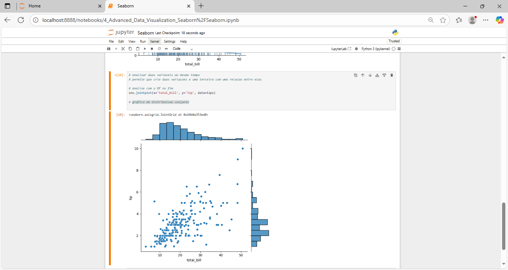

### English 💌

# 🐍 Python -  Advanced Data Visualization with Seaborn - Asimov Academy

### What is this course?  
In the course **Advanced Data Visualization with Seaborn**, you will go from the basics to advanced techniques for building **informative and attractive charts**.  

### 📘 You will learn:  
- Introduction to Seaborn and data visualization  
- How to create custom plots (histograms, pairplots, boxplots, bar plots, violin plots, swarmplots)  
- How to use **heatmaps** and **clustermaps** with `pivot_table`  
- How to style your plots with colors, fonts, and themes  
- How to find and show patterns in data  

### 👩‍💻 This course is for:  
- Beginners in data visualization  
- Data analysts  
- Python developers  
- Data scientists  
- Students of data science and engineering  

---

👉 Start today and learn how to **tell stories with your data** using Seaborn!  

-------

--------

### img projects: Advanced Data Visualization with Seaborn

## Screenshots

Here are some images showing the layout of the application:

________________________________________

<h4 align="center">Advanced Data Visualization with Seaborn 🥰 🚀</h4>

    <table>
        <tr>
            <td style="width: 50%; text-align: center;">
                
                
Curva_ estatística

            </td>
            <td style="width: 50%; text-align: center;">
                
                
Grafico_distribuicao_conjunta

            </td>
        </tr>
    </table>

   
   

________________________________________

    <table>
        <tr>
             <td style="width: 50%; text-align: center;">
                
                
Codig_Type_BD

            </td>
            <td style="width: 50%; text-align: center;">
                
                
Table_Type

            </td>
        </tr>
    </table>

   
   

  ________________________________________

  
<h4 align="center">Advanced Data Visualization with Seaborn 🥰 🚀</h4>

    <table>
        <tr>
            <td style="width: 50%; text-align: center;">
                
                
Insert_date_Table

            </td>
            <td style="width: 50%; text-align: center;">
                
                
Filter_conditional_AND

            </td>
        </tr>
    </table>

   
   

________________________________________

    <table>
        <tr>
             <td style="width: 50%; text-align: center;">
                
                
Alter_name_index_name

            </td>
            <td style="width: 50%; text-align: center;">
                
                
BD_SQlite_memorry_disck_Rigd

            </td>
        </tr>
    </table>

   
   

  ________________________________________

<h4 align="center">Advanced Data Visualization with Seaborn 🥰 🚀</h4>

    <table>
        <tr>
            <td style="width: 50%; text-align: center;">
                
                
grafico_03_Evolução media por regiao

            </td>
            <td style="width: 50%; text-align: center;">
                
                
GDP_Per_Person_Img/19_matplotlib_grafic_estimativ

            </td>
        </tr>
    </table>

   
   

________________________________________

    <table>
        <tr>
             <td style="width: 50%; text-align: center;">
                
                
Year_project_new

            </td>
            <td style="width: 50%; text-align: center;">
                
                
img_interative

            </td>
        </tr>
    </table>

   
   

  ----

### Portugues💌

# 🐍 Python -  Advanced Data Visualization with Seaborn - Asimov Academy

### O que é este curso?  
No curso **Visualização de Dados Avançada com Seaborn**, você vai aprender desde os fundamentos até técnicas avançadas para construir **gráficos envolventes e cheios de informação**.  

### 📘 O que você vai aprender:  
- Introdução ao Seaborn e à visualização de dados  
- Como criar gráficos personalizados (histogramas, pairplots, boxplots, gráficos de barras, violin plots, swarmplots)  
- Como usar **heatmaps** e **clustermaps** com `pivot_table`  
- Como estilizar seus gráficos com cores, fontes e temas  
- Como revelar e comunicar padrões nos dados  

### 👩‍💻 Este curso é indicado para:  
- Iniciantes em visualização de dados  
- Analistas de dados  
- Desenvolvedores Python  
- Cientistas de dados  
- Estudantes de ciência de dados e engenharia  

---

----

Python: Linguagem principal utilizada para desenvolver o app.

________________________________________
### Python: The main programming language used to build the app.

#### 🤝 Contributing
If you would like to contribute to this project, feel free to open an issue or submit a pull request! 🚀
________________________________________
#### 📜 License
This project is licensed under the MIT License - see the LICENSE file for details.
👩💻 Developed with 💙 by [[LuDiemert](https://www.linkedin.com/in/lucianadiemert/)]

________________________________________
- #### My LinkedIn - 

________________________________________
## 🌐 **Contact**

#### [**Luciana Diemert**](https://github.com/ludiemert)

🛠 Full-Stack Developer  
🖥️ Python | Computer Vision | AI Integrations  
📍 T23 R2RV,  Cork - Irland 
☎ +353 87 243 8690

&nbsp;
&nbsp;
&nbsp;
&nbsp;

 

---
Developed with ❤ by [ludiemert](https://github.com/ludiemert).
